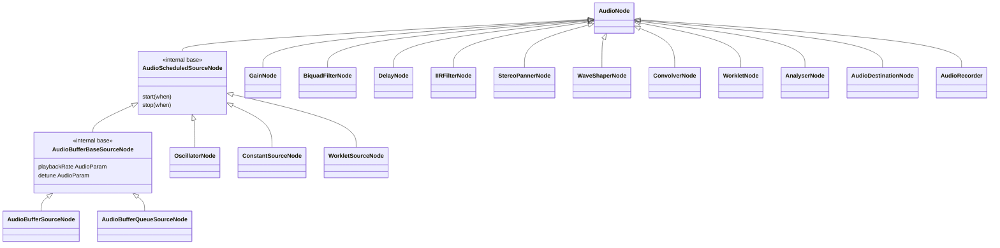

# Skill: AudioNodes

Golden references: `GainNode.h/.cpp` (effect node), `OscillatorNode.h/.cpp` (scheduled source). Mirror their structure for any new node. See [gainnode-example.md](gainnode-example.md) for an annotated header + .cpp.

**If spec defaults or parameter ranges are unclear → fetch https://webaudio.github.io/web-audio-api/ before writing any constructor code.**

---

## Directory Structure

```
common/cpp/audioapi/core/
├── AudioNode.h / .cpp               # Base class for all nodes
├── AudioParam.h / .cpp              # Automatable parameter
├── BaseAudioContext.h / .cpp        # Engine + node factory
├── AudioContext.h / .cpp            # Real-time context
├── OfflineAudioContext.h / .cpp     # Offline rendering context
├── sources/
│   ├── AudioScheduledSourceNode.h   # Base for start/stop sources (INTERNAL)
│   ├── AudioBufferBaseSourceNode.h  # Base for buffer playback (INTERNAL)
│   ├── OscillatorNode.h / .cpp
│   ├── AudioBufferSourceNode.h / .cpp
│   ├── AudioBufferQueueSourceNode.h / .cpp
│   ├── ConstantSourceNode.h / .cpp
│   ├── WorkletSourceNode.h / .cpp
│   └── RecorderAdapterNode.h / .cpp
├── effects/
│   ├── GainNode.h / .cpp
│   ├── BiquadFilterNode.h / .cpp
│   ├── DelayNode.h / .cpp
│   ├── IIRFilterNode.h / .cpp
│   ├── StereoPannerNode.h / .cpp
│   ├── WaveShaperNode.h / .cpp
│   ├── ConvolverNode.h / .cpp
│   ├── WorkletNode.h / .cpp
│   ├── channel_merger/             # ChannelMerger internal input/output nodes (composite)
│   ├── channel_splitter/           # ChannelSplitter internal input/output nodes (composite)
│   └── PeriodicWave.h / .cpp        # Wave table (not a node)
├── analysis/
│   └── AnalyserNode.h / .cpp
├── destinations/
│   └── AudioDestinationNode.h / .cpp
├── inputs/
│   └── AudioRecorder.h / .cpp
└── utils/
    └── AudioGraphManager.h / .cpp
```

---

## The Audio Thread Contract

`processNode()` runs on the **audio thread** — the real-time rendering thread driven by the native audio driver (Oboe on Android, CoreAudio on iOS). This thread has strict requirements:

**MUST NOT in `processNode()`:**
- Allocate or free memory (`new`, `delete`, `malloc`, `free`, `std::vector::push_back` that grows, etc.)
- Acquire any mutex or lock (`std::mutex`, `std::lock_guard`, etc.)
- Make any blocking syscall (file I/O, socket, `sleep`, `wait`)
- Call into JavaScript — no JSI calls, no `callInvoker_->invokeSync()`
- Throw exceptions (or rely on exception unwinding paths that allocate)

**Preallocate everything in the constructor:**
```cpp
// Constructor — JS thread, allocations OK
GainNode::GainNode(const std::shared_ptr<BaseAudioContext> &context, const GainOptions &options)
    : AudioNode(context, options) {
  // Preallocate the AudioBuffer used during processing
  audioBuffer_ = std::make_shared<AudioBuffer>(channelCount_, context->getBufferSize());

  // Preallocate params — they own their internal AudioBuffer too
  gainParam_ = std::make_shared<AudioParam>(
      options.gain, -3.4028234663852886e+38f, 3.4028234663852886e+38f, context);
}

// processNode — audio thread, NO allocations
std::shared_ptr<AudioBuffer> GainNode::processNode(
    const std::shared_ptr<AudioBuffer> &processingBuffer,
    int framesToProcess) {
  // Already-allocated buffer reused each render quantum
  auto gainValues = gainParam_->processARateParam(framesToProcess, time);
  for (size_t i = 0; i < processingBuffer->getNumberOfChannels(); i++) {
    processingBuffer->getChannel(i)->multiply(*gainValues->getChannel(0), framesToProcess);
  }
  return processingBuffer;
}
```

---

## Processable State (reverse-topo pull)

Which nodes run each render quantum is decided by `AudioGraph::settleProcessableState()`, run inside `Graph::process()` after toposort/compaction and before the forward `iter()` pass. It is an **audio-thread-only** concern — never derived from HostGraph adjacency (that mutates on the JS thread under `nodesMutex_`).

`GraphObject::PROCESSABLE_STATE`:
- `ALWAYS_PROCESSABLE` — seed / pull root. Set in ctors of `AudioDestinationNode` and `AnalyserNode`. Never reset by settle.
- `CONDITIONAL_PROCESSABLE` — on this quantum because something processable downstream pulls it. Recomputed from scratch every quantum.
- `NOT_PROCESSABLE` — idle / disconnected / default.

Settle algorithm (allocation-free):
1. **Reverse pull**: walk the topo-sorted node array sinks → sources; for every `ALWAYS_`/`CONDITIONAL_PROCESSABLE` node, mark its inputs (and processable-links) `CONDITIONAL_PROCESSABLE`. Iterates to a fixpoint for processable-links.
2. **End-of-quantum demotion**: after `processInputs()`, each node that was `CONDITIONAL_PROCESSABLE` flips back to `NOT_PROCESSABLE` in `GraphObject::process()`. That replaces a global reset at the start of settle — nodes that ran last quantum are already idle when the next pull begins.

Key invariants:
- **Pull from `processableState_`, never `AudioNode::isProcessable()`.** A tail-bearing node (Delay/Convolver/Biquad) overrides `isProcessable()` to stay `true` while its tail drains after a disconnect; using that for the pull would wrongly re-activate its whole upstream cone. The tail node stays scheduled via that override; its `processableState_` is `NOT_PROCESSABLE`, so it correctly does not pull upstream.
- **`disable()` is sticky.** `AudioNode::disable()` sets `NOT_PROCESSABLE` **and** `alwaysNotProcessable_ = true`, so a finished source still wired to a live consumer is not re-activated by the every-quantum pull. Sources call `disable()` from the audio thread when playback finishes.
- **DelayReader → DelayWriter** have no audio edge (they share a ring buffer). `Graph::linkNodes(reader, writer)` records a processable-link, mirrored onto `AudioGraph::Node::link_head`. Settle follows links so pulling the reader also pulls the writer and the writer's inputs. Links are NOT part of the topological sort (that would create a cycle for feedback delays).

---

## Class Hierarchy



### AudioScheduledSourceNode (internal only — not exposed to JS directly)

Base class for source nodes that have a scheduled start and stop time. **Not instantiated directly.**

```cpp
// Playback state machine
enum class PlaybackState {
  UNSCHEDULED,      // before start() called
  SCHEDULED,        // start() called, waiting for startTime_
  PLAYING,          // actively producing audio
  STOP_SCHEDULED,   // stop() called, waiting for stopTime_
  FINISHED          // done, node will be disabled
};
```

Subclasses call `updatePlaybackInfo(currentTime, framesToProcess)` at the top of `processNode()` to transition the state machine and handle sample-accurate start/stop.

When the node finishes, fire the `ENDED` event to JS via `audioEventHandlerRegistry_->invokeHandlerWithEventBody(AudioEvent::ENDED, {})`.

---

## processNode() Signature

```cpp
protected:
  /// @note Audio Thread only
  virtual std::shared_ptr<AudioBuffer> processNode(
      const std::shared_ptr<AudioBuffer> &processingBuffer,
      int framesToProcess) = 0;
```

- `processingBuffer` — already contains the mixed input from all connected input nodes. Modify in-place and return it.
- `framesToProcess` — number of samples per channel to process, typically 128 (RENDER_QUANTUM_SIZE).
- Called by `AudioNode::processAudio()` which handles input mixing, channel count modes, and deduplication (via `lastRenderedFrame_`).

---

## Thread Annotations in Header Files

**Annotate every method with the thread it is safe to call from.** Use comments in the header:

```cpp
class MyNode : public AudioNode {
 public:
  /// @note JS Thread only
  void setSomething(float value);
  float getSomething() const;

 protected:
  /// @note Audio Thread only
  std::shared_ptr<AudioBuffer> processNode(
      const std::shared_ptr<AudioBuffer> &processingBuffer,
      int framesToProcess) override;
};
```

In `AudioParam.h` the pattern is:
```cpp
/// @note JS Thread only
[[nodiscard]] inline float getValue() const noexcept { ... }
void setValue(float value);
void setValueAtTime(float value, double startTime);

/// Audio-Thread only methods (idempotent per quantum — see below)
std::shared_ptr<DSPAudioBuffer> processARateParam(int framesToProcess, double time);
float processKRateParam(double time); // k-rate is quantum-wide
```

---

## AudioParam — Automatable Parameters

Every automatable property (frequency, gain, detune, Q, etc.) is an `AudioParam`.

```cpp
gainParam_ = std::make_shared<AudioParam>(
    defaultValue,
    minValue,
    maxValue,
    context
);
```

### A-rate vs K-rate

- **A-rate (audio-rate)**: one value per sample — use when the parameter can change significantly within a render quantum (e.g. frequency modulation)
  ```cpp
  // Call processARateParam() for per-sample values — returns AudioBuffer, no allocation
  auto gainValues = gainParam_->processARateParam(framesToProcess, time);
  float *values = gainValues->getChannel(0)->getData();
  // values[i] is the gain for frame i
  ```

- **K-rate (control-rate)**: one value per render quantum — use when the parameter changes slowly
  ```cpp
  // Call processKRateParam() for a single quantum-wide value
  float gain = gainParam_->processKRateParam(time);
  // Single value for the whole block
  ```

### Param class hierarchy & idempotency

`AudioParam` and `CompositeAudioParam<CombineFunction>` both derive from the abstract
`GeneralizedAudioParam` base (`core/GeneralizedAudioParam.h`), which owns the nominal
range, the a-rate `outputBuffer_`, and the per-quantum memoization state, and centralizes
clamping via `finalizeKRate` / `finalizeARate`.

- **`AudioParam`** — the only JS-connectable param; owns `inputBuffer_` (BridgeNode modulation).
- **`CompositeAudioParam<Fn>`** (`core/CompositeAudioParam.h`) — represents a spec
  `computedValue` (e.g. `computedOscFrequency`). `Fn` is a pure, captureless free function
  (defined in the owning node's header, next to the composite member) taking float children
  and returning float; its arity is deduced. It processes each child, folds `Fn` over them,
  and clamps to its own nominal range. No `inputBuffer_`.

`processKRateParam(time)` / `processARateParam(frames, time)` are **idempotent**: a repeat
call with the same arguments returns the cached result and does **not** re-consume modulation.
This is why a composite and a node can both read the same child param in one quantum. It also
means `processNode()` should read `context->getCurrentTime()` **once** and thread that same
`double` into every param call so the cache keys match (the context clock is constant within a
quantum). Consequently, unit tests that re-process the same node must advance the clock (e.g.
`context->processGraph(buffer.get(), frames)`) between renders.

**Clamping (§ 1.6.3):** automation intrinsic values are computed **without** clamping (see
`getValueAtTimeUnmodulated` / `ParamRenderQueue`). Clip only in `finalizeKRate` /
`finalizeARate` after adding modulation — never on the intrinsic alone before modulation.

### JS → Audio Thread parameter updates

`CrossThreadEventScheduler<T>` is a lock-free SPSC channel. When JS calls `param.setValueAtTime(...)`, it enqueues a lambda on the scheduler. The audio thread drains the queue at the start of each `processARateParam` / `processKRateParam` call.

```cpp
// JS-thread (in AudioParam):
void AudioParam::setValueAtTime(float value, double startTime) {
  eventScheduler_.scheduleEvent([value, startTime](AudioParam &param) {
    param.eventsQueue_.insertEvent(...);
  });
}

// Audio-thread (inside processARateParam):
eventScheduler_.processAllEvents(*this);  // drain all pending events
```

**Important**: HostObject setters forward to the node/param asynchronously through this scheduler. By the time `processNode()` runs, the queued update may or may not have been applied yet, depending on timing. Design accordingly — never assume immediate consistency.

---

## Cross-Thread Communication Patterns

### JS → Audio (parameter/graph updates)
Use `CrossThreadEventScheduler` (lock-free SPSC queue). See `utils/CrossThreadEventScheduler.hpp`.

### Audio → JS (events like `ended`, `loopEnded`, `positionChanged`)
Use `IAudioEventHandlerRegistry::invokeHandlerWithEventBody()` which internally calls `callInvoker_->invokeAsync()` — this safely schedules the JS callback on the JS thread from the audio thread.

```cpp
// Audio-thread: fire 'ended' event
audioEventHandlerRegistry_->invokeHandlerWithEventBody(
    AudioEvent::ENDED, {});
```

Callback IDs are stored as `std::atomic<uint64_t>` on the node. `0` means no listener registered.

### JS → Audio (graph mutations: connect/disconnect)
All graph mutations are queued via `AudioGraphManager` using its own SPSC channel (`addPendingNodeConnection`, `addPendingParamConnection`). The audio thread calls `graphManager_->preProcessGraph()` before each render pass to apply pending changes.

### Settable channel attributes (channelCount / channelCountMode / channelInterpretation)
These are mutable after construction. `AudioNode` (core) exposes virtual `setChannelCount` / `setChannelCountMode` / `setChannelInterpretation`. `channelCount` and `channelCountMode` are read only on the host thread during negotiation, so the JSI setter updates the core field directly then calls `HostNode::renegotiate()` → `Graph::renegotiateNodeChannels()` → `HostGraph::renegotiateNodeChannels()` (reuses `collectNegotiations` + an `AGEvent` buffer swap, self-drain aware when there is no audio/render consumer — offline construction/suspend and realtime suspended/stopped windows). When `AudioBufferSourceNode` `setBuffer` changes channel width, update `channelCount_` on the host thread then `renegotiate()` so MAX/CLAMPED_MAX downstream nodes update; the audio event still installs the prebuilt buffer (no audio-thread alloc). `channelInterpretation` is read on the audio thread in `processInputs` (`getInputBuffer()->sum(*input, channelInterpretation_)`), so it MUST be applied via `scheduleAudioEvent`, not mutated directly.

### Idle-node stale-buffer zeroing (settleProcessableState)
`AudioGraph::iter()` filters to `isProcessable()` nodes, so a node that has gone idle (e.g. a finished source) is skipped and its output buffer is NOT refreshed — it keeps the samples from an earlier quantum. Downstream consumers still read that buffer via `getOutput()` when collecting inputs, which would re-sum ghost echoes every quantum (this broke the `audionode-channel-rules` ~170-node WPT test).

Fix: after the reverse-topo pull in `AudioGraph::settleProcessableState()`, zero the output buffer of every node that is still `!isProcessable()`. Active CONDITIONAL nodes have already been pulled, so they are left intact; tail-bearing nodes remain `isProcessable()` while draining and are also left intact.

Do **not** gate `GraphObject::process()` on `isProcessable()` of inputs: CONDITIONAL nodes demote themselves to `NOT_PROCESSABLE` at the end of their own `process()` call, before downstream consumers run in the same topological pass — an `isProcessable()` gate would drop every live conditional input every quantum.

`AudioNode::disable()` only sets `alwaysNotProcessable_` (sticky: settle must not re-activate a finished source). The current quantum's output stays intact for downstream mixing; the next settle zeros the idle buffer. No deferred `pendingDisable_` flag is needed once settle performs idle zeroing.

Tail-bearing nodes (Delay/Convolver/Biquad) need no special handling: while connected they stay `CONDITIONAL_PROCESSABLE`; after disconnect they stay `isProcessable()` via the tail override until the impulse decays, so settle does not zero them mid-tail.

### WSOLA (pitchCorrection) source invariants
Hard-won invariants for `AudioBufferBaseSourceNode::processWithPitchCorrection` and back-to-back scheduled joins (`b2.start(t1 + D/pr)`, join compensation L = 0):

- **Feed real PCM only.** Never let `updatePlaybackInfo`-zeroed start-quantum frames enter the WSOLA analysis queue; mid-quantum starts must instead shift WSOLA's rendered output into `startOffset` after synthesis.
- **Content accounting caps the EOF drain.** Track PCM consumed (in output-time frames, `vReadIndex_` delta / rate) vs frames emitted, and stop draining when emitted catches expected — otherwise silence-padded OLA hops spill past `duration/rate` and overlap the next scheduled source.
- **COLA startup seeding.** On the first synthesis iteration after reset, seed `pendingOverlap_` with the leading half of the first block so output starts at full amplitude (no half-window fade-in).
- **WSOLA whenever `pitchCorrection` is on.** Including `playbackRate == 1` — do not bypass to the non-WSOLA path at unity rate.
- **Queue EOF needs `endOfStream()`.** An empty queue without that signal is only an underrun; with it, the base drain path runs even when `isEmpty()`.

`AudioFileSourceNode` still has its own prime/drain path (not yet shared).

---

## Implementing a New Node — Checklist

1. **Subclass the right base**
   - `AudioNode` — standard effect or analysis node
   - `AudioScheduledSourceNode` — source with start/stop scheduling
   - `AudioBufferBaseSourceNode` — source that plays back an AudioBuffer with pitch control

2. **Header file** (`core/<category>/MyNode.h`)
   - Annotate every method with `/// @note JS Thread only` or `/// @note Audio Thread only`
   - Declare `processNode()` in `protected:`
   - Declare `AudioParam` members for automatable properties
   - Preallocate all buffers you'll need in `private:` state

3. **Constructor** (runs on JS thread)
   - Call `AudioNode(context, options)` base constructor with correct `numberOfInputs`, `numberOfOutputs`
   - Create all `AudioParam` instances with correct default/min/max values from the Web Audio spec
   - Preallocate any DSP state buffers (IIR delay lines, ring buffers, etc.)
   - Do NOT call `context_->...` in `processNode()` for anything that could block

4. **processNode()** (runs on audio thread)
   - Call `context_.lock()` to get a `shared_ptr<BaseAudioContext>` — return early if null
   - Call `context->getCurrentTime()` for automation timing
   - Use `processARateParam()` or `processKRateParam()` to read param values
   - Process samples in-place on `processingBuffer`
   - No allocations, no locks, no blocking I/O

5. **HostObject** (see the `host-objects` skill)
   - Create `MyNodeHostObject` extending `AudioNodeHostObject`
   - Add factory method to `BaseAudioContextHostObject` (`createMyNode`)
   - Add factory method to `BaseAudioContext` C++ class

6. **TypeScript API** (see the `turbo-modules` skill)
   - Add TS class in `src/core/`
   - Export from package index

7. **Spec compliance**
   - Check the Web Audio API spec for default values, parameter ranges, and behavior
   - See `web-audio-api` skill

8. **Tests and docs** — see the `flow` skill

See [full GainNode example](gainnode-example.md) for a complete header + .cpp reference implementation.

---

## Web Audio API Spec Reference

All node behavior (parameter names, default values, valid ranges, processing semantics) must match the spec:
- https://webaudio.github.io/web-audio-api/

Key spec-defined constraints already encoded in the codebase:
- `AudioParam` min/max values come from spec tables
- `GainNode.gain` default = 1.0, no clamping
- `BiquadFilterNode.frequency` default = 350 Hz, range [Nyquist - epsilon, Nyquist]
- `OscillatorNode.frequency` default = 440 Hz
- Render quantum = 128 frames

---

*Maintenance: see [maintenance.md](maintenance.md).*
