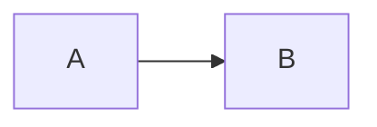

# packages/internaldocs/ — Internal documentation

Docusaurus 3 site. Docs are MDX in `docs/`. Not published; run locally.

## Commands

```bash
yarn start   # dev server
yarn build   # production build
yarn serve   # serve the built site
```

From the monorepo root: `yarn docs:internal` / `yarn docs:internal:build`.

## What belongs here

Write for a maintainer who was not in the design conversation. No chat-log voice.

- **Here:** why the system is shaped this way, research outcomes, plans.
- **Skills / `AGENTS.md`:** implementation checklists for agents.
- **`packages/audiodocs`:** public JavaScript API.

Prefer short pages. Split when a heading is a standalone topic. Cross-links use relative `.mdx` paths.

## Sidebar

Same pattern as `audiodocs`: topic folders, `_category_.json` (`label`, `position`), `sidebar_position` on pages. Do not create `architecture/`, `research/`, or `plans/` folders.

When a subject already exists in `audiodocs` (`core`, `sources`, `effects`, …), reuse that folder name. Internal-only subjects get their own topic folder (`graph/`, `cpp-tests/`, …). Add a folder when the first page for that topic lands.

A plan, WIP write-up, or research note lives in its topic folder. Tag it with one or more labels:

```yaml
---
sidebar_position: 1
sidebar_custom_props:
  tags: [plan, wip]    # plan, wip, research — any combination
---
```

Each tag appears to the right of the page name. When the page becomes ordinary documentation, delete `tags`. Do not move the file. Do not put `tags` on `_category_.json`.

## Diagrams

New figures are Mermaid fences. Existing Whimsical / Excalidraw boards: export SVG, split to about one content-column wide, store under `static/diagrams/<slug>/`, embed with `DiagramCompare`.

````mdx
import DiagramCompare from '@site/src/components/DiagramCompare';

<DiagramCompare originals={['/diagrams/graph/original-1.svg']}>



</DiagramCompare>
````

When the New figure is accepted, drop the Original tab and the SVG files.
