# Graph implementation

[Processing model](./processing-model.mdx) explains why the graph exists twice and what each copy is for. This page is about how the
two copies are built. It names the classes, because the point is to make the code readable. Everything lives in
[`core/utils/graph/`](https://github.com/software-mansion/react-native-audio-api/tree/1966b4ac91efb990f1bc626fdb8899b034b770f4/packages/react-native-audio-api/common/cpp/audioapi/core/utils/graph).

| Class | Thread | Role |
|---|---|---|
| `Graph` | both | The facade. Owns the other two, the event channels and the pre-growth bookkeeping. |
| `HostGraph` | JS | Adjacency lists, validation, ghost nodes. Every mutation returns an event for the audio side. |
| `AudioGraph` | audio | Flat, topologically sorted node array. Toposort, compaction, processable-state settling, iteration. |
| `InputPool` | audio | Slot pool backing every per-node list in `AudioGraph`. |
| `NodeHandle` | shared | The one object both graphs point at: the `GraphObject` and its current index in `AudioGraph`. |
| `GraphObject` | audio | What a node is from the graph's point of view: `process()`, an output buffer, processable state. `AudioNode` derives from it. |

## Node handle

```cpp
struct NodeHandle {
  std::unique_ptr<GraphObject> audioNode;
  std::uint32_t index;   // position in AudioGraph::nodes, audio thread writes it
};
```

A handle is created on the JS thread with `std::make_shared` and stored in both `HostGraph::Node` and `AudioGraph::Node`, so its reference
count is 2 for as long as the node is alive in both graphs. `AudioGraph` sorts and compacts its array freely and rewrites `index` after every
move, which is how an event built on the JS thread (`graph[handle->index]`) finds the right node when it runs on the audio thread. `index`
is never read on the JS thread.

The count going from 2 to 1 is the signal that the audio thread has dropped the node. Nothing else is sent; the host side polls
`use_count() == 1` when it is convenient (see [Ghost collection](#ghost-collection)).

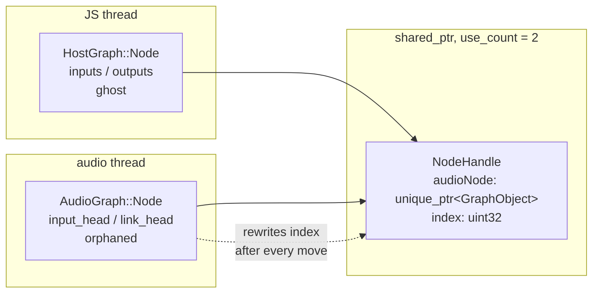

A node's life, seen through the handle's reference count:

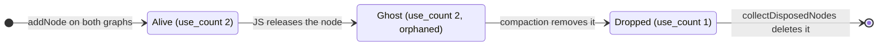

The audio thread decides *when* (a node may be a ghost for a long time if it is still playing), and the JS thread does the deleting.

## Host graph

`HostGraph::Node` is a plain adjacency-list node:

```cpp
struct Node {
  std::vector<Node *> inputs;       // reversed edges
  std::vector<Node *> outputs;      // forward edges
  std::vector<Node *> linkedNodes;  // processable-state links, see below
  TraversalState traversalState;    // DFS visit stamp
  ChannelLayoutState channelLayout; // pending channel-count negotiation
  std::shared_ptr<NodeHandle> handle;
  bool ghost = false;
};
```

All nodes are heap-allocated and held in a `std::vector<Node *>`, so pointers stay valid across mutations; `Graph::addNode` returns the raw
pointer, and the `HostNode` RAII wrapper keeps it until destruction. Every public method takes `nodesMutex_`. That mutex is JS-side only: it
serializes the JS thread against the GC finalizer thread, which also calls `removeNode`. The audio thread never touches `HostGraph`.

### Validation

`addEdge(from, to)` rejects, in this order: a node that is not in the graph, a ghost on either end, an edge that already exists, and a cycle.
The cycle check is `hasPath(to, from)`: a DFS over `outputs` that would find a path from `to` back to `from`. Instead of a visited set, each
node carries a `term` stamp and the graph has a monotonically increasing counter, so a traversal marks a node visited by writing the current
term and no per-traversal storage is cleared. The DFS uses an explicit stack (`std::vector`), which allocates, and that is fine on the JS thread.

### Events

Every mutation returns an `AGEvent`: a closure that captures node handles and applies the same structural change on the audio side by
index. `addNode` captures nothing but the handle and appends it; `removeNode` flips one flag; `addEdge` pushes one pool slot and marks the
order dirty. That structural part is small and the same shape for every mutation.

What varies is the memory a mutation needs the audio thread to start using. The rule from the processing model applies here: anything that
has to be allocated is allocated on the JS thread while the event is being built, captured by pointer, and swapped in when the event runs.
Which allocations a given event carries depends on what it changes:

- A new edge may leave the destination's input-scratch vector too small, so `addEdge` ships a replacement reserved to the new input count.
  `addNode` and `removeNode` touch no lists and ship none.
- A connection or disconnection can change channel counts along the path toward the destination. The JS thread negotiates the new widths and
  ships a fresh render buffer for every node whose width actually changed; a connection that alters no layout ships an empty batch, and a
  plain `addNode` does not negotiate at all.

Whatever the audio thread replaces this way, an old scratch vector or an old render buffer, is handed to the disposer from inside the event,
so the audio thread never frees it. The `addEdge` event shows all of that in one place:

```cpp
[hTo, hFrom, negotiations, reservedInputs](AudioGraph &graph, auto &disposer) mutable {
  applyChannelNegotiations(*negotiations, disposer);          // swap in new render buffers, dispose old ones
  disposer.dispose(std::move(negotiations));
  disposer.dispose(toNode->exchangeInputScratch(std::move(*reservedInputs)));
  disposer.dispose(std::move(reservedInputs));
  graph.pool().push(graph[hTo->index].input_head, hFrom->index); // the structural change itself
  graph.markDirty();
}
```

### Ghosts

`removeNode` does not delete anything. It flips `ghost = true` and returns an event that sets `orphaned = true` on the audio node. The ghost
keeps its `inputs` and `outputs`, so `hasPath` still walks through it. That matters because the node is still alive in `AudioGraph`, where its
edges still exist, and a cycle that goes through a ghost is a real cycle on the audio thread. `addEdge` and `removeEdge` refuse ghosts as
endpoints, but traverse them.

### Ghost collection

`collectDisposedNodes` scans for ghosts whose handle has `use_count() == 1`, removes them from the vector (swap with last, pop), and
`delete`s them. `Node::~Node` unlinks the node from every neighbour's `inputs` and `outputs`. This runs on the JS side, so `delete` is fine.
It is called from `HostNode::~HostNode` just before `removeNode`, and from the context's promise worker before a lifecycle operation, so
ghosts are collected as a side effect of the next node going away rather than on a timer.

## Audio graph

`AudioGraph::Node` holds no pointers to other nodes, only indices, and packs its scratch fields into bitfields:

```cpp
struct Node {
  std::shared_ptr<NodeHandle> handle;
  std::uint32_t input_head = kNull;   // head of this node's input list in the pool
  std::uint32_t link_head  = kNull;   // head of this node's processable-link list
  std::uint32_t topo_out_degree : 31; // scratch, toposort
  unsigned      will_be_deleted : 1;  // scratch, compaction
  std::int32_t  target_index : 31;     // scratch, where the node moves to; ready-stack link during the sort
  unsigned      orphaned : 1;         // set by the removeNode event
};
```

The nodes live in a `std::vector<Node>` that is kept in topological order, sources first, sinks last. Three properties follow:

- **An input always has a lower index than its consumer.** A forward pass renders each node after everything it reads from.
- **Rendering is one linear walk** over contiguous memory. `iter()` filters out non-processable nodes and yields each node with a view of its
  inputs, resolved from indices to `GraphObject &` on the fly.
- **Indices are unstable.** Both sorting and compaction move nodes. Anything that has to survive a move goes through the handle's `index`.

### Per-quantum call order

`Graph` exposes three calls and the render loop makes them in this order every quantum:

```cpp
graph.processEvents();   // drain both channels, apply mutations
graph.process();         // toposort if dirty, compact, settle processable state
for (auto &&[node, inputs] : graph.iter()) { node.process(inputs, frames); }
```

`processEvents` is the only step that may touch memory that was not there a quantum ago (it adopts pre-grown buffers). Everything after it is
allocation-free.

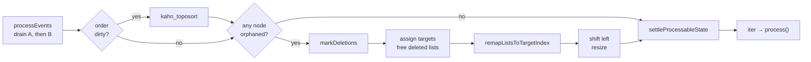

The steps between `kahn_toposort` and `settleProcessableState` make up `sortAndCompact()`. In the steady state, no edge changed and nothing is
orphaned, so the quantum takes the two `no` branches and the whole thing is a `bool` test plus one scan of the `orphaned` bits.

### Topological sort

The sort runs only when an edge was added or removed since the last one; the edge events mark the order dirty. It is Kahn's algorithm run in
reverse, sinks first, and it uses no extra memory:

1. Count each node's out-degree by walking every input list and incrementing the *input's* counter (`topo_out_degree`).
2. Push every node with out-degree 0 (the sinks) onto a ready stack. The stack is a linked list threaded through `target_index`, so it costs
   nothing to allocate. Any order of taking ready nodes gives a valid topological order, so a stack is enough.
3. Pop until the stack is empty. Each popped node gets the next position counting down from the end (`--write`), written into the same
   `target_index` field that held its stack link a moment ago. Every input whose out-degree drops to 0 is pushed. Sinks end up at the back,
   sources at the front.
4. Rewrite every index stored in the pool (inputs and links) to the new positions. This has to happen before nodes move.
5. Apply the permutation in place with cycle sort: `while (nodes[i].target_index != i) swap(nodes[i], nodes[target])`.
6. Write the new position into each handle's `index` and reset scratch.

Cycles cannot reach this code because `HostGraph` rejects them, so every node is eventually popped.

#### Worked example

Three nodes inserted in the wrong order for rendering: the destination first, then a gain, then an oscillator, wired `Osc → Gain → Dest`.
Each node's input list holds array indices, not node names: `Dest.inputs = [1]` is one input, the node currently at index 1 (`Gain`), and
`Gain.inputs = [2]` is one input, the node at index 2 (`Osc`). The diagrams below draw the array in index order and write each input as
`index = node` so the two are easy to tell apart.

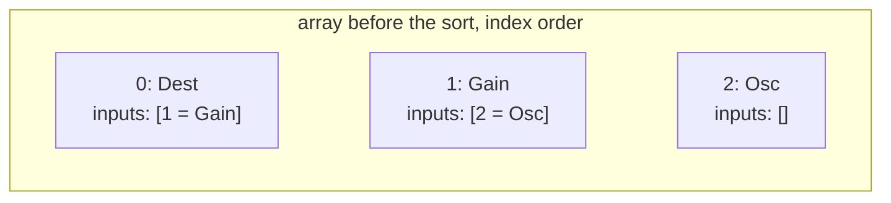

Phase 1 counts out-degrees: `Osc 1, Gain 1, Dest 0`. Phase 2 then runs the stack. Each row is the state after the operation in the first column;
`target_index` shows the field's meaning at that moment, a stack link (`→`) or a final position:

| step | stack (top first) | `write` | Dest | Gain | Osc |
|---|---|---|---|---|---|
| push Dest (out-degree 0) | Dest | 3 | → −1 | −1 | −1 |
| pop Dest, assign `--write` | *empty* | 2 | **2** | −1 | −1 |
| Dest's input Gain reaches 0, push | Gain | 2 | 2 | → −1 | −1 |
| pop Gain, assign | *empty* | 1 | 2 | **1** | −1 |
| Gain's input Osc reaches 0, push | Osc | 1 | 2 | 1 | → −1 |
| pop Osc, assign | *empty* | 0 | 2 | 1 | **0** |

Phase 3 rewrites the stored indices through `target_index` while the nodes are still in place: `Dest.inputs [1]` stays `[1]` because Gain's
target is 1, and `Gain.inputs [2]` becomes `[0]` because Osc's target is 0. Phase 4 cycle-sorts: at `i = 0`, `Dest` wants position 2, so it
swaps with `Osc`; now every node is at its target. Phase 5 writes `handle->index` and resets the field to −1.

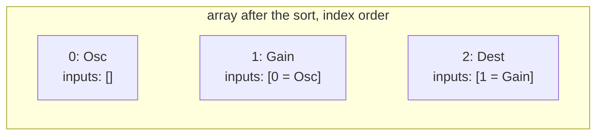

Every input now sits at a lower index than its consumer. That is the guarantee rendering relies on: walking the array left to right, by the time
a node is processed every one of its inputs has already been processed, so its input buffers hold this quantum's data. Here `Osc` renders first
with nothing to wait for, `Gain` finds Osc's output ready, and `Dest` finds Gain's.

### Compaction

Compaction removes nodes the audio thread is done with. A node is removed when it is `orphaned`, has no inputs left, and the node itself
agrees it can be destroyed (a source that is still playing says no). It is two passes over the array:

1. **Mark, then scrub.** Marking runs left to right in topological order and only reads: a node is marked when it is orphaned, every
   input of it is already marked, and it agrees. Because inputs come before consumers, an orphaned chain collapses in one pass: the source
   is marked, its consumer sees only marked inputs, and so on. Scrubbing runs afterwards, once every mark is final, and drops every input
   and link entry that points at a marked node in one loop; direction no longer matters, so links need no special treatment here.
2. **Assign, remap and shift.** Survivors get consecutive `target_index` values in array order; deleted nodes keep −1 and hand their pool
   slots back right away. Every stored index is rewritten through `target_index` (the same helper the sort uses), then survivors are moved left
   with a single read cursor and write cursor. Slots past the write cursor have their `handle` set to null, which is the `2 → 1` decrement the
   host side is waiting for, and `resize` drops them; on a vector that only shrinks, that does not allocate.

Rewriting indices before moving nodes is the order that matters. Once a node has moved, the old index stored in someone's input list points at
whatever is now sitting there.

Compaction runs only when at least one node is `orphaned`. Without one, nothing can be marked, so the whole thing is skipped.

#### Worked example

Continuing from the sorted array above. JS has dropped its reference to both `Osc` and `Gain`, so both are `orphaned`; the oscillator has
finished playing, so it reports it can be destroyed. The destination is untouched.

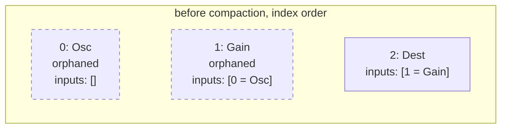

The mark pass walks left to right:

| node | scrub inputs pointing at marked nodes | orphaned | inputs empty | can be destroyed | marked |
|---|---|---|---|---|---|
| Osc | `[]` → `[]` | yes | yes | yes | **yes** |
| Gain | `[0 = Osc]` → `[]` (Osc is marked) | yes | yes, now | yes | **yes** |
| Dest | `[1 = Gain]` → `[]` (Gain is marked) | no | | | no |

`Gain` was only removable because `Osc` was handled first, which is why this pass needs the array sorted. Then the survivors get their targets
(`Dest → 0`), the deleted nodes free their (already empty) lists, the remap finds nothing left to rewrite, and the shift moves `Dest` to position
0. Positions 1 and 2 get their handles nulled and the vector is resized to 1.

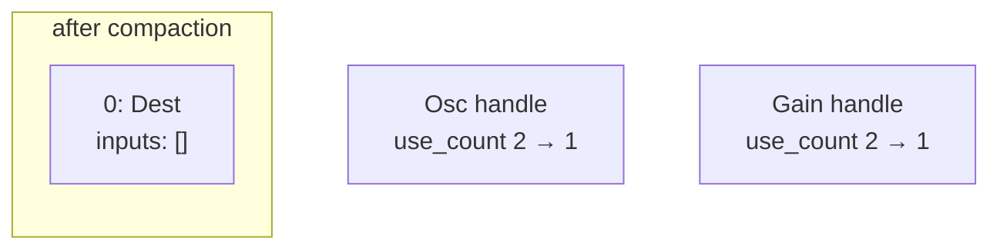

The two released handles are what `HostGraph::collectDisposedNodes` will find on the JS side.

### Processable state and links

Not every node in the array should render. Which ones do is decided once per quantum, after compaction. A node is in one of three states:
*always processable* for the pull roots (the destination, an analyser), *not processable*, or *conditionally processable* for nodes that are
pulled this quantum only. The settle is a reachability walk: starting from every node that is not *not processable* on entry (the roots), it
promotes each dependency from *not* to *conditional* and continues from the nodes it just promoted. A node's dependencies are its audio
inputs plus its **links** (below). The walk is a depth-first traversal that borrows `target_index` as an embedded stack, the same trick the
toposort uses for its ready set, and it uses the state itself as the visited marker: a node is pushed only on its *not* to *conditional*
transition, so every node and every list is visited once and the pass is O(V+E). A conditional node flips itself back to *not* after it
renders, so the cone is re-derived from the roots every quantum with no global reset.

Because the walk is reachability and not an array scan, it does not care where a dependency sits in the array. That is what lets links share
the loop with inputs. Some nodes have to be rendered together without an audio edge between them; the delay node's reader and writer share a
ring buffer and are the example. A link is a one-way entry in the second per-node list (`link_head`). Links take no part in the toposort and
carry no audio, so a link target may sit at a higher index than the node that pulls it, which an index-ordered scan would have to revisit.

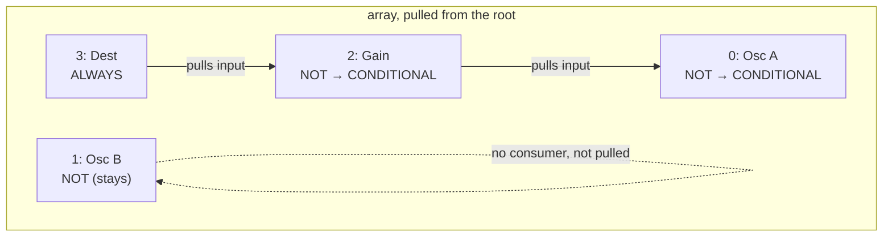

`Osc B` is in the array and sorted correctly, but nothing downstream of it is processable, so it is not rendered this quantum. Its state is not
touched at all; `iter()` simply skips it.

## Input pool

Every list an `AudioGraph::Node` owns, inputs and links, is a singly linked list whose nodes are slots in one `InputPool`. A slot is 8 bytes:

```cpp
struct Slot {
  union {
    struct { std::uint32_t val; std::uint32_t next; }; // in a list
    std::uint32_t next_free;                            // on the free list
  };
};
```

`val` is the index of the input node, `next` the index of the next slot, `kNull` (`UINT32_MAX`) terminates a list. Unused slots are threaded
into a free list through `next_free`, which overlaps `val`. Adding an input is `push`: pop a slot from the free list, write `val` and `next`,
make it the new head. Removing one is a walk to the slot and a push back onto the free list. Both are O(1) in memory and never call the allocator.

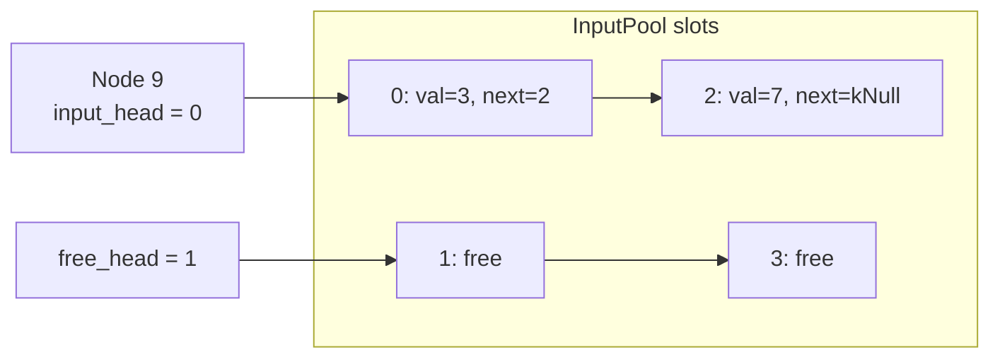

Indices rather than pointers keep a slot at 8 bytes and, more importantly, keep the lists valid when the whole pool is copied into a bigger
buffer.

### Growth

The pool can grow itself, and does so during construction and in tests, but on the audio thread the free list must never run dry. That is
arranged on the JS side: `Graph` remembers the capacity it has ensured so far, and before it sends any event that pushes a slot it checks
whether the host-side edge and link count exceeds half of it. If so it allocates a slot array twice the current need and sends a grow event
ahead of the mutation. On the audio thread the pool copies the old slots with `memcpy` (valid because they hold indices, not pointers),
threads the new slots onto the free list, swaps the buffer in and returns the old one, which the event hands to the disposer.

The node vector grows the same way: the host node count is compared with the ensured capacity, a vector with the new capacity is reserved on the
JS thread, and the audio thread adopts it by moving every live node across. Both checks run *before* the mutation event is sent, so the FIFO
channel delivers the grow first.

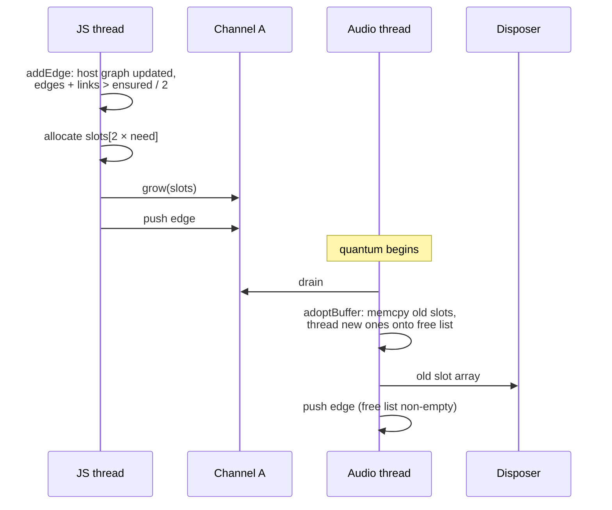

## Event channels

`Graph` owns two SPSC channels into the audio thread, one per producing thread:

- **Channel A**, JS thread producer: `addNode`, `addEdge`, `removeEdge`, `removeAllEdges`, `linkNodes`, channel renegotiation and grow events.
- **Channel B**, GC finalizer producer: `removeNode` only, because `HostNode` destructors run on the JS GC thread.

A single-producer channel keeps its order, but two channels have no order between them. That matters for exactly one pair of messages: a
node's removal on B must not be applied before that node's creation, or a connection to it, that is still queued on A. So every removal sent
on B remembers how much of channel A had been written at that moment, and the audio thread does not apply it until it has drained A at least
that far. `processEvents` is therefore: drain A, then apply whatever on B is now allowed. A removal that is not yet allowed, because the JS
thread is mid-send, waits for the next quantum.

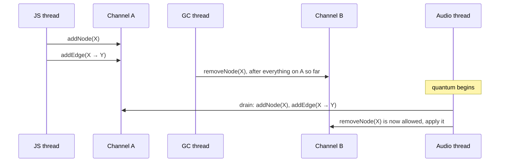

"So far" is enough because the GC thread flips the host-side `ghost` flag before it sends, and from that moment `addEdge` / `removeEdge`
refuse the node, so nothing that references it can be sent on A afterwards. The rule turns "sent before" on the producers' side into "applied
before" on the audio side without a lock between the two producers.
