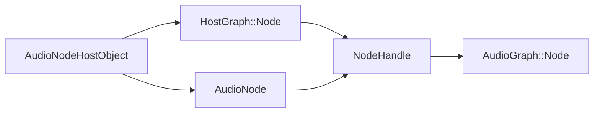

import DiagramCompare from '@site/src/components/DiagramCompare';

# Overview

Template page for graph internals. Replace this write-up when the real architecture note is ready. The `Plan` and `WIP` tags in the sidebar come from `sidebar_custom_props.tags` in the frontmatter.

The three layers that share one `NodeHandle`:

<DiagramCompare originals={['/diagrams/graph/original-1.svg']}>

</DiagramCompare>
