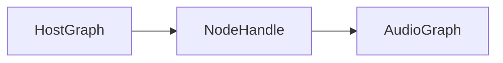

import DiagramCompare from '@site/src/components/DiagramCompare';

# Overview

Template page for graph internals.

The two graph layers share one `NodeHandle`:

<DiagramCompare originals={['/diagrams/graph/original-1.svg']}>

</DiagramCompare>
