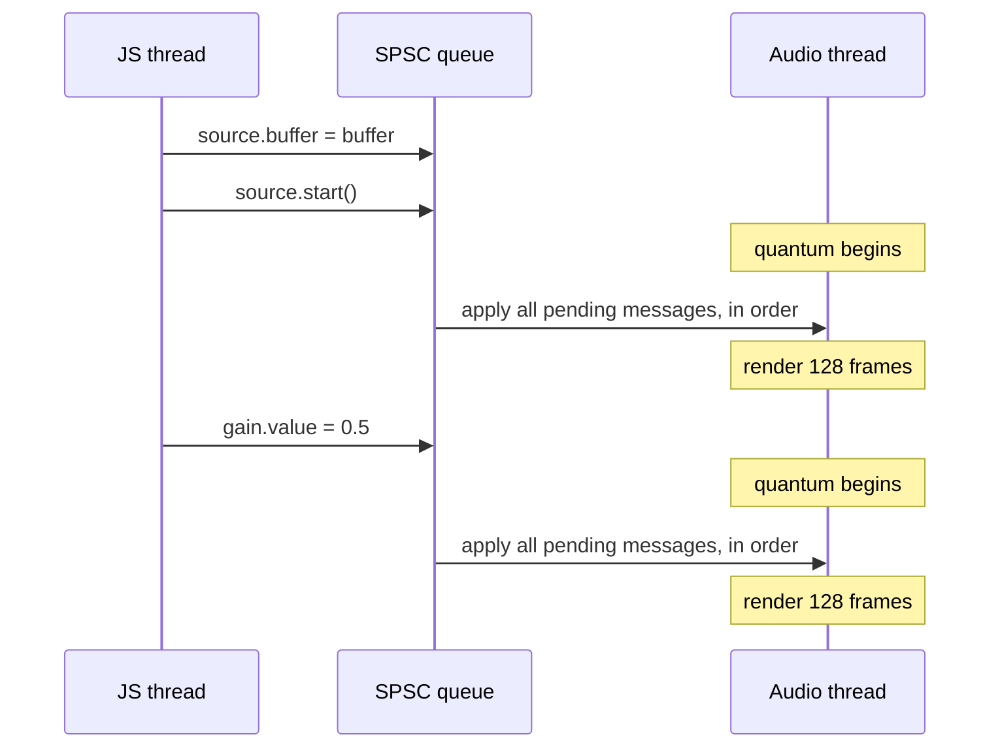

# Processing model

## Threads
Mainly there are three threads involved in the whole pipeline:
- JS thread (creates objects and sets up pipeline elements)
- Audio thread (renders audio and copies data to provided memory)
- JS garbage collector thread (deallocates unused object)

## Alloc-free

This is the easiest one to achieve, almost all of the objects are created by the JavaScript thread, which means that we can prepare almost
everything that we would need upfront and reuse them on the audio thread.

The general rule is: **the JS thread allocates, the audio thread only swaps pointers.**`AudioBufferSourceNode.setBuffer`
is the typical example: the HostObject copies the buffer, allocates the matching AudioBuffer and initializes the stretcher on the JS thread,
and the audio event that reaches the render loop only assigns the ready-made pointers.

The places below are the ones where that rule was not enough and we had to do something less obvious.

### Events that carry their own storage

Every JS → audio message is a closure. It is implementation defined whether `std::function` wrapping the event would heap-allocate on the sending side, and
free it on the audio thread after the call. Turns out it was exactly the case on android and ios. To ensure lack of the allocation we use [special wrappers instead](https://github.com/software-mansion/react-native-audio-api/blob/1966b4ac91efb990f1bc626fdb8899b034b770f4/packages/react-native-audio-api/common/cpp/audioapi/utils/FatFunction.hpp):
the function closure is stored inline in `N` bytes, and a memory is asigned at compile time.

### A graph that grows without allocating

The graph has to accept new nodes and edges in the middle of rendering, which with a `std::vector` means an occasional reallocation.
Two things prevent it:

- **Edges live in a shared pool**, not in a per-node `std::vector`. The pool is one flat array in which every node's inputs form a linked list,
  and the unused slots form a free list. Adding or removing an edge only relinks slots that already exist.
- **Growth is pre-paid by the JS thread.** The JS thread knows how many nodes and edges the graph holds, so it notices that the storage is running
  out before the audio thread does. It then allocates a bigger one and sends it to the audio thread ahead of the mutation that needs the space.
  Messages arrive in order, so the space is always there in time. The audio thread then moves its data into the new storage.

Channel-count negotiation works the same way: the new layout and the buffers for it are computed and allocated on the javascript thread, and the
audio thread applies them.

### Fixed-capacity queues

Where growth makes no sense we simply bound the structure. The automation events of an `AudioParam` sit in a queue of fixed size, allocated
together with the param. The cost is visible from JS: a param cannot hold more than 256 pending automation events.

### Work that cannot be alloc-free

Some work allocates by nature: writing a recording to a file, decoding, anything that calls into a library we do not control. The audio thread
does not do it. It only describes the work in a small message and leaves it for a dedicated worker thread, which is free to allocate, block and
take as long as it needs. The message queue between the two is allocated once, when the worker is created, so posting a message costs the audio
thread a copy into memory that already exists and nothing more.

This is not a general mechanism that every node goes through. It exists only in the few places where such work is unavoidable, and each of them
owns its own worker: the recorder uses one to move captured audio off the audio thread before it is written to a file or delivered to a JS callback.

## Lock-free

A mutex shared with the audio thread is a problem even when it is held only for a moment. The JS thread runs with normal priority, so the OS is
free to suspend it while it holds the lock. The audio thread then waits for a thread that is not even running, and the quantum is late. This is
called priority inversion, and the only reliable way to avoid it is to have no lock to wait on.

We get there with one rule: **the state used for rendering belongs to the audio thread, and nobody else touches it.** When JS sets a property
or calls a method on a node, the JS thread does not write the new value into the node. It wraps the change in a small message and puts it on a queue.
The audio thread takes it from there and applies the change itself. Since only one thread ever reads or writes that state, there is nothing to protect.

### Shadow state

The rule leaves one question open: what does JS get back when it reads the property it has just set? Asking the audio thread is not an option;
a round trip through the queue would take a whole quantum, and a getter has to return right away.

The answer is that each property exists twice. The C++ node holds the copy the audio thread renders with. The HostObject, the object that
JS talks to, holds a second copy, the **shadow state**, that only the JS thread reads and writes. A setter does two things: it updates the shadow
copy and sends the message. A getter returns the shadow copy and never looks at the node.

```cpp
void setLoop(bool loop) {
  scheduleAudioEvent([node, loop] { node->setLoop(loop); });
  loop_ = loop;   // shadow copy, JS thread only
}

bool getLoop() {
  return loop_;   // never node->getLoop()
}
```

Each copy has exactly one owning thread, so neither needs a lock. The two may disagree for up to one quantum, while the message is in flight,
and that is fine, the difference is inaudible.

Shadow state works only for values that the audio thread never changes on its own. A property the audio thread advances, such as the playhead
position or `currentTime`, cannot be shadowed; for those we use atomics (see [The other direction](#the-other-direction)).

### The queue

The queue is a single-producer, single-consumer (SPSC) ring buffer.
[Detailed implementation](https://github.com/software-mansion/react-native-audio-api/blob/1966b4ac91efb990f1bc626fdb8899b034b770f4/packages/react-native-audio-api/common/cpp/audioapi/utils/SpscChannel.hpp).
Knowing that there is exactly one thread on each end is what makes it cheap. The ring has a write position and a read position. The JS thread
is the only one that moves the first, the audio thread is the only one that moves the second, and each of them only reads the other's position
to tell whether the ring is full or empty. There is no retry loop on either side, so both operations finish in a bounded number of steps.

The ring is allocated once, together with the audio context, and the messages store their closure inline (see
[Events that carry their own storage](#events-that-carry-their-own-storage)), so the queue is alloc-free as well. It is bounded: when it is full,
sending fails and the JS thread is told so. The audio thread never waits for the queue under any circumstances.

### Handled before rendering

The audio thread empties the queue at the very beginning of every render quantum, and only then starts rendering:



A few properties follow from this:

- **Nodes never change in the middle of a quantum.** Every change lands between two quanta, which is why rendering code does not have to be
  defensive about its own fields. This is also where the ~2.9 ms timing resolution of non-scheduled changes comes from.
- **Order is preserved.** The queue is first-in, first-out, so the audio thread sees changes in the order JS made them. `source.buffer = buffer`
  followed by `source.start()` works because the buffer is always applied first. This only holds if *every* change to a node goes through
  the queue. A setter that wrote directly to the node "because it is safe in this case" would overtake the messages sent before it.
- **Getters do not ask the audio thread.** They return the [shadow state](#shadow-state), which may be ahead of the audio thread by one quantum.

### When the audio thread is not running

A suspended or not yet started context has no audio thread to empty the queue, so messages would wait there indefinitely. In that state the JS thread
applies the change itself, after first emptying whatever is left in the queue to keep the order. This path does take a mutex, and it is the one
visible in the code that schedules a message. The mutex guards starting and stopping the audio driver, so that the driver cannot come to life in the
middle of such a direct change. It is shared between the JS thread and the worker that starts and stops the driver. The realtime audio callback never takes it.

### More than one sender

"Single producer" is a hard requirement of the queue, and the JS thread is not the only thread with something to say. The garbage collector
destroys JS objects on its own thread, and a destroyed object may need to tell the audio thread to forget a callback. It gets a queue
of its own. The audio thread empties the JS queue first and the GC queue second, because the cleanup of a node logically comes after the last
changes JS made to it.

### The other direction

The audio thread also has things to report. Values that JS polls, like `currentTime`, are plain atomics that the audio thread writes and the
JS thread reads. Events such as `ended` go through a lock-free queue in the opposite direction and are delivered to JS callbacks by the JS thread.
The audio thread only posts them and never waits for them to be delivered.

## Dealloc-free

Freeing memory is as bad as allocating it. `free` takes the same allocator lock and may return pages to the OS, and a large object such as a
decoded audio buffer can also run a long chain of destructors. So the audio thread must not only avoid creating objects, it must avoid being the
last owner of one. That is harder than it sounds, because the audio thread is exactly the place where the old value stops being needed: a buffer
is replaced, a node finishes playing, a connection is removed.

### The disposer

The rule is the mirror image of the alloc-free one: **the audio thread hands objects over, and someone else destroys them.**
The context owns a small worker thread whose only job is to run destructors,
[detailed implementation](https://github.com/software-mansion/react-native-audio-api/blob/1966b4ac91efb990f1bc626fdb8899b034b770f4/packages/react-native-audio-api/common/cpp/audioapi/core/utils/Disposer.hpp).
When the audio thread is done with an object, it moves the object into a fixed-size message and pushes it on an SPSC queue to that worker. The
queue is the same kind as the one in the [lock-free section](#the-queue), with the roles reversed: the audio thread is the producer. The
worker takes the message, runs the destructor, and that is where the memory is freed.

The message is small (24 bytes) and stores the object inline, so what usually travels is a smart pointer or a container header, not the data.
The audio thread has to be the sole owner at that moment: sending a `shared_ptr` that is also held on the JS side would only move a reference
count decrement, and the destructor would still run wherever the last reference goes away. If the queue is ever full, the object is destroyed
on the calling thread instead. That is a violation, but a silent leak would be worse.

Every place where the audio thread replaces or drops an object goes through this path: a source node swapping buffers or finishing, a convolver
replacing its impulse response, the graph adopting a bigger storage and letting go of the old one.

### Nodes

A node is the largest thing the audio thread ever stops needing, and it is not disposed through the worker. Its lifetime is split in two:

- On the **audio thread**, a node whose JS object was released is marked as orphaned. The next time the graph is compacted, and once the node
  has nothing left to render, it is dropped from the audio graph. Dropping it only releases one reference to a shared handle, which is a single
  atomic decrement.
- On the **JS side**, whenever another node is released, the host side of the graph looks for handles that only it still holds. Those are the
  nodes the audio thread has let go, and this is where they are deleted.

So the audio thread decides *when* a node dies, and the JS thread does the deleting. This is why a node can be garbage-collected by JS while it is
still playing: the C++ node stays alive until the audio thread is done with it.

### Objects destroyed by the garbage collector

The JS engine collects HostObjects on a thread of its own, at a time of its choosing. A HostObject destructor must therefore never touch the audio
thread's state directly. It sends a message on the [GC queue](#more-than-one-sender), and the audio thread does the cleanup at the start
of a quantum, like any other change. The message has to be safe to skip: if the context is already closed there is no audio thread to run it.

## Double graph

The previous sections describe how a single value gets from JS to the audio thread. The graph itself, the set of nodes and the connections
between them, follows the same rules: it belongs to the audio thread, and JS changes it by sending messages. A single graph owned by the audio
thread would be enough for rendering.

The problem is that `connect()` can fail. A connection may close a cycle, name a node that is gone, or duplicate an edge that exists, and the
Web Audio API says the call throws. With one graph, only the audio thread could answer those questions, because only it may look at the graph.
The check would run inside the quantum, taking render time for work that has nothing to do with rendering, and the answer would then have to
travel back to JS through another lock-free queue, one quantum later, when the `connect()` call has already returned. A synchronous
exception cannot be built out of a round trip.

So the JS thread keeps a graph of its own, one it can consult immediately, and the audio thread keeps the one it renders from. The graph exists twice.

### Two copies, two owners

- The **host graph** lives on the JS thread. It is an ordinary adjacency-list graph, optimized for questions: does this node exist, is this
  edge already there, would this connection close a cycle. It is what `connect()` and `disconnect()` talk to, and where they fail with an error
  before anything reaches the audio thread.
- The **audio graph** lives on the audio thread. It is a flat array of nodes kept in topological order, sources first, sinks last, so that
  rendering is a single pass over the array. It is optimized for the per-quantum work: sorting, compaction and iteration, all alloc-free (see
  [A graph that grows without allocating](#a-graph-that-grows-without-allocating)).

Each copy is touched only by its own thread. Every mutation of the host graph produces a message that applies the same mutation to the audio
graph, sent through the queue from the [lock-free section](#the-queue) and applied at the start of a quantum. The host graph is therefore always
ahead, by at most one quantum, and the audio graph never sees a mutation the host graph has rejected.

### Ghosts

Removing a node shows why the two copies need to be slightly out of step. When JS releases a node, the host graph does not delete it. It marks it as a
**ghost** and keeps its edges. The node is still alive in the audio graph, possibly still producing sound, and any connection JS makes in the
meantime must be validated against the graph as the audio thread will see it, ghosts included. Otherwise a cycle could pass the host check and
reach the audio thread. The ghost is removed only when the audio graph has let go of the node.

### Why not one graph with a lock

The other way to let JS look at the audio thread's graph would be a mutex. It would be held during connect, which is a cycle check over the whole
graph, and during render, which is the whole quantum. Either one blocking the other is exactly the priority inversion from the
[lock-free section](#lock-free). Two copies cost some memory and one message per mutation, and buy a graph that JS can query at once and the
audio thread can walk without ever waiting.

How the two copies are built, sorted, compacted and grown is described in [Graph implementation](./graph-implementation.mdx).
